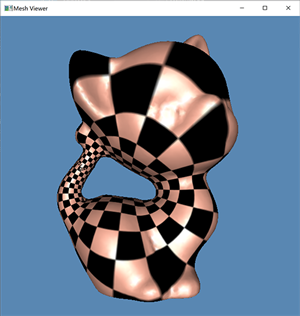
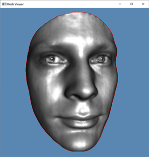

# A MeshLib demo

This C++ project framework is used to help students to debug geometric algorithms. It contains a halfedge data structure library `MeshLib` and an simple opengl viewer.

## System

The code is only tested on Windows, but it should work on Linux and Mac with minor midifications. If there is any problem on the latter two platforms, please let me know.

## Dependencies
 
1. `MeshLib`, a mesh library based on halfedge data structure.
2. [freeglut](http://conformalgeometry.org/attaches/freeglut.zip), a free-software/open-source alternative to the OpenGL Utility Toolkit (GLUT) library.

## Directory Structure

``` txt
include        -- The header files.
src            -- The source files. 
data           -- Some models and texture images.
CMakeLists.txt -- CMake configuration file.
```

## Configuration

### Windows

1. Install `MeshLib`, `freeglut`, the download links have been given in **Dependencies** section.

> E.x. I first create a folder `dev` in disk `C:/`, and install the libraries in it. Then I add `C:/dev/` to the system or user `PATH` variable to make sure that `CMake` can find them automatically.
> 
> After that, unzip `MeshLib`, `freeglut` into `C:/dev/` directly and add `C:/dev/freeglut/bin/x64` to the system or user `PATH` variable in order to ensure other executable programs can find `freeglut.dll`.

2. Install [CMake](https://cmake.org/download/).

3. Download the source code of the C++ framework.
> E.x. I create a folder `projects` in `C:/`, then:
> ``` bash
> cd projects
> git clone {URL_TO_THIS_DEMO}.git
> ```

4. Configure and generate the project for Visual Studio.
  
> ``` bash
> cd Demo
> mkdir build
> cd build
> cmake ..
> ```
> *One can also finish this step using CMake GUI.*

5. Open the \*.sln using Visual Studio, and complie the solution.

6. Run the executable program.
> E.x. 
> ``` bash
> cd ../bin/
> ./MyDemo.exe ../data/kitten.m ../data/texture_checker.bmp
> ./MyDemo.exe ../data/Alex_rgb.m
> ```
> If you can see the following results, then it means that the configuration succeeded. 
> 
>  